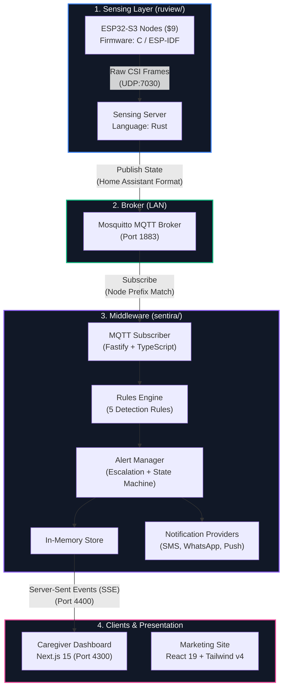

# WiFi Tracker — Camera-Free Elder Monitoring

[](LICENSE)
[](docs/ARCHITECTURE.md#design-constraints)
[](ruview/README.md)
[](sentira/packages/middleware)
[](sentira/packages/dashboard)

> [!IMPORTANT]
> **Sentira WiFi Tracker** is a privacy-first, camera-free, and wearable-free elder monitoring system. By analyzing **Wi-Fi Channel State Information (CSI)** from low-cost ESP32-S3 nodes, the system tracks presence, respiration trends, fall risks, and inactivity anomalies in real-time.

---

## Repository Architecture

This workspace is structured as a multi-project monorepo containing three core components:

```text
wifi-tracker/
 ruview/          Upstream WiFi sensing platform (MIT, by rUv) - C/Rust firmware & sensing server
 sentira/         Caregiver monitoring system - rules engine, alert lifecycle, and dashboard
 sentira-landing/   Sentira marketing landing page - Vite + React 19 + Tailwind CSS v4
```

---

## System Dataflow & Connection

The sensing layer (`ruview/`) and the application layer (`sentira/`) are completely decoupled at the code level. Communication occurs asynchronously over your local area network (LAN) via **MQTT**.



### Technical Stack Comparison

| Dimension | `ruview/` | `sentira/` |
| :--- | :--- | :--- |
| **Primary Language** | Rust (Sensing Server) + C (ESP32 Firmware) | TypeScript (Next.js + Node.js) |
| **Build & Package System**| Cargo + ESP-IDF | `pnpm` monorepo workspace |
| **Runtime Target** | ESP32-S3 hardware + Raspberry Pi / PC | Raspberry Pi / Linux Host (or Docker) |
| **MQTT Role** | Publisher (Publishes sensor & vitals data) | Subscriber (Consumes events & routes alerts) |
| **Dependency Status** | Upstream core (Runs fully standalone) | Consuming app (Requires MQTT feed or mock) |
| **Core Content** | C firmware, DSP crates, 180+ ADR records | Middleware API, Next.js Dashboard, CLI mock |

---

## Hardware Requirements

A robust monitoring system built on highly affordable components with privacy at the core:

| Component | Estimated Cost | Role |
| :--- | :--- | :--- |
| **ESP32-S3 (8MB Flash)** | ~$9 | WiFi CSI sensing node (runs `ruview` firmware) |
| **WiFi Router (2.4 GHz)** | — | Radio signal source for CSI frame generation |
| **Raspberry Pi 4+ (4GB)** | ~$45 | Host server for `sentira` middleware + dashboard |
| **Additional ESP32-S3** | ~$9 / each | Optional nodes for multi-room coverage extension |

> [!NOTE]
> **No Cameras. No Wearables. 100% Local Processing & Privacy.**

---

## Quick Start & Integration

Follow this path to spin up the local environment and simulate sensing events.

### 1. Clone & Set Up Workspace

```bash
# Clone the repository
git clone https://github.com/subhxroy/wifi-tracker.git
cd wifi-tracker
```

### 2. Run the Sentira Dashboard & Middleware

There are two primary modes to run the application workspace:

#### Option A: Docker Compose (All-in-One, Recommended for Pi)
This starts Mosquitto, the Node.js middleware API, and the Next.js dashboard concurrently:
```bash
cd sentira
docker compose up -d
# Access the dashboard at http://localhost:4300
```

#### Option B: Hybrid Dev Mode (Broker in Docker, Source Code on Host)
Ideal for modifying dashboard components or middleware rules:
```bash
cd sentira

# Start Mosquitto broker
docker compose up -d mosquitto

# Install dependencies and start components
pnpm install --ignore-scripts
pnpm --filter @sentira/middleware start   # Terminal 1 (API, Port 4400)
pnpm --filter @sentira/dashboard dev      # Terminal 2 (Next.js Dashboard, Port 4300)
pnpm --filter @sentira/mock-ruview start  # Terminal 3 (Hardware simulator)
```

### 3. Flash Hardware CSI Nodes (Optional)
To stream real CSI telemetry instead of using the simulator, flash the ESP32-S3 device:
```bash
cd ruview/firmware/esp32-csi-node
python3 provision.py --ssid "Your-WiFi-Name" --password "WiFi-Password" --target-ip "<host-pi-ip>"
```

---

## MQTT Topic Contract

The system adheres to standard Home Assistant auto-discovery formats to facilitate seamless integration:

```text
homeassistant/<component>/wifi_densepose_<mac>/<slug>/state
```

* **`<component>`**: `binary_sensor`, `sensor`, or `event`
* **`<mac>`**: The unique physical MAC address of the sensing ESP32 node (e.g., `aabbccddeeff`).
* **`<slug>`**: The state entity name. The middleware processes 21 distinct slugs:
  * *Safety / Critical*: `presence`, `fall`, `no_movement`, `possible_distress`, `elderly_inactivity_anomaly`
  * *Vitals / Activity*: `breathing_rate`, `heart_rate`, `motion_level`, `motion_energy`, `room_active`
  * *Smart Home*: `someone_sleeping`, `bathroom_occupied`, `bed_exit`, `person_count`, `presence_score`, `rssi`, `zone_occupancy`, `pose`

> [!TIP]
> You can override the subscription prefix filter by setting `RUVIEW_NODE_PREFIX` in `sentira/packages/middleware/.env` (default is `wifi_densepose`).

---

## Caregiver Rules & Alerts

Sentira applies stateful logic over raw sensor feeds to minimize false alarms and coordinate caregiver responses:

| Alert Type | Severity | Logic Summary |
| :--- | :--- | :--- |
| **Fall Detection** | High | Dual-stage trigger: registers high-energy fall spike followed by zero movement for 20s. Ignores single drops (e.g., dropped books). |
| **Inactivity Anomaly**| High | Sensor registers active presence, but zero movement exceeding day (2 hr) or night (8 hr) parameters. |
| **Respiration Trend** | Medium | Checks breathing rate trend. Flags when 3+ out-of-range anomalies occur in a 5-minute rolling window. |
| **Sensor Offline** | Medium | Node heartbeats run every 15s. Flags alert if no packet received within a 90s window. |

### Notification & Escalation Chain
* **High Severity Alerts**: Dispatched via SMS, WhatsApp, and push notifications immediately and in parallel to primary emergency contacts. Escalates to secondary contacts after 180s of inactivity.
* **Medium Severity Alerts**: Logged to the dashboard and sent via silent push notifications. Auto-resolves once the telemetry clears.

---

## Marketing Landing Page

The `sentira-landing/` directory is a standalone Vite project serving as the marketing presentation page for Sentira. It shares the same sleek liquid-glass design language as the dashboard.

```bash
cd sentira-landing
npm run dev     # Start development server
npm run build   # Build distribution assets into /dist
```

---

## Diagnostics & CLI Reference

Run these commands from the root or within `sentira/` to quickly debug or test rule behaviors:

```bash
# Type-check the monorepo packages
pnpm typecheck

# Simulate specific hardware sensor scenarios
pnpm --filter @sentira/mock-ruview start                       # Normal daily baseline
pnpm --filter @sentira/mock-ruview start -- --scenario fall    # Inject sudden fall event
pnpm --filter @sentira/mock-ruview start -- --scenario inactivity # Inject inactivity anomalies

# Direct API queries
curl http://localhost:4400/health        # Liveness check
curl http://localhost:4400/api/overview   # Caregiver overview state
```

---

## Attribution & License

This workspace packages two independently licensed open-source modules:

1. **`ruview/`**: Upstream WiFi sensing core, copyright © 2024 **rUv**. Licensed under the [MIT License](ruview/LICENSE). Sentira consumes the MQTT interface as-is without code modifications.
2. **`sentira/` & `sentira-landing/`**: Original monitoring application, caregiver workflows, API, and landing designs. Licensed under the [MIT License](LICENSE).

---

## Developer Brain
For detailed information regarding route registries, data schemas, or system diagrams, consult the codebase database documentation in [BRAIN.md](BRAIN.md).
